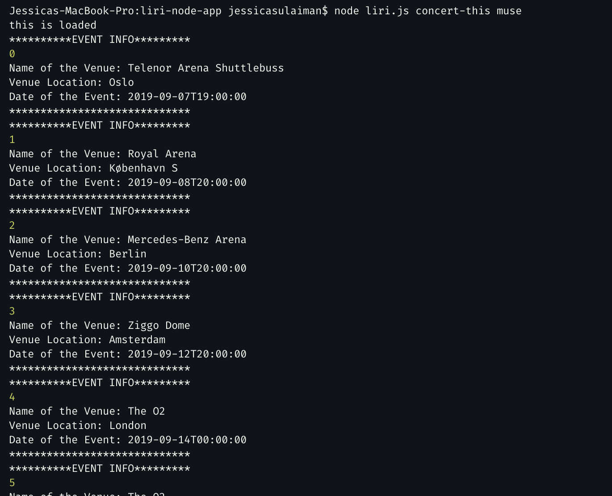
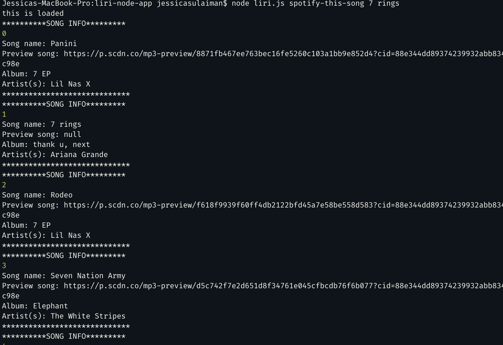
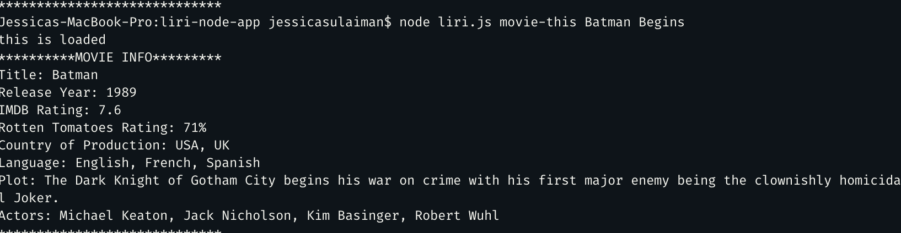
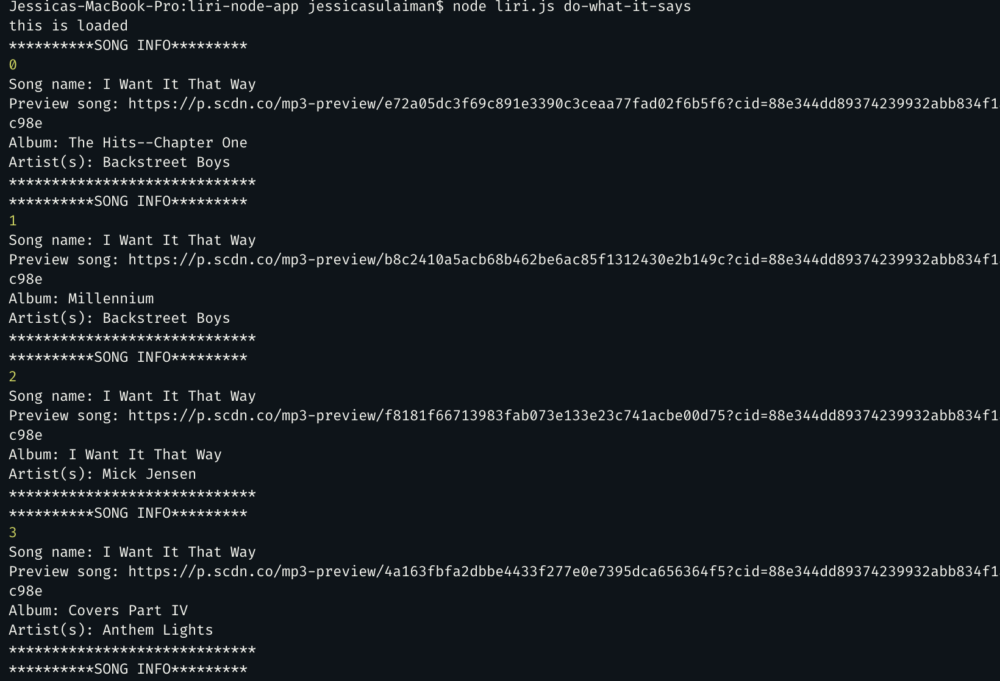

# liri-node-app
## About: 
Liri is a CLI app (command-line interface). Liri is a language interpretation and recognition interface. LIRI will be performed on the command line using node that takes in parameters and gives you back data.

Using the Spotify api, you can search for songs.
Using the Bands in Town api you can search for concerts
Using the OMDB api you can search for movies.

The commands the user may use are:
* concert-this
* spoftify-this-song
* movie-this
* do-what-it-says
---
## How to use LIRI App:

1. Open your terminal
2. Open file liri.js 
3. User chooses which command to run at a time

* Command:
    node liri.js concert-this <name of band or artist>
    * Output: This will display a list of all the events and locations that the artist or band will perform. When running the command the results will be appended in the log.txt 
    As shown in the screen shot below:
    

* Command: 
    node liri.js spotify-this-song <name of song>
    * Output: This will display a list of information related to the song. The app will log the results in the log.txt file. As shown in the screen shot below:

* Command:
    node liri.js movie-this <name of movie>
    * Output: The app will display information of the movie. The results will also be logged. As shown in the screen shot below:

* Command:
    node liri.js do-what-it-says
    * Output: The app will read random.txt file and perform the command written in the file.
    As shown in the screen shot below:

## Tech Used
* Javascript
* Nodejs
* Node packages: 
    * Axios
    * Moment
    * Dot Env
* Node-Spotify-API
    * Moment
    * DotEnv
* APIs:
    * Spotify
    * Bands in Town
    * OMDb

